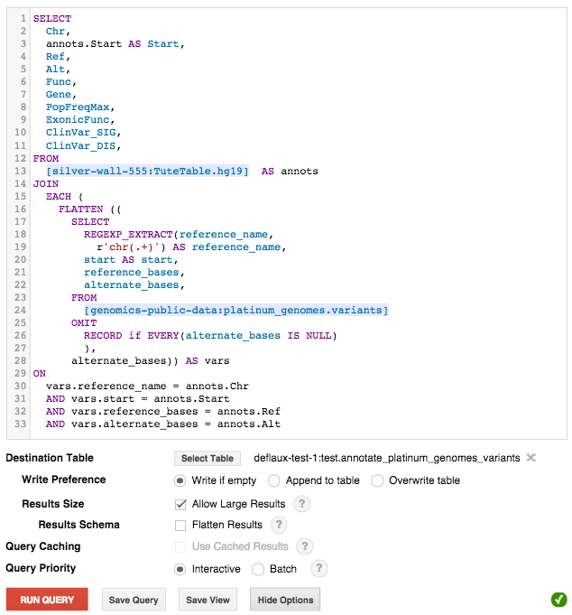

+--------------------------------------------------------------------------------------------------------------+
| Note: Google Genomics is now Cloud Life Sciences.                                                            |       
| The Google Genomics Cookbook on Read the Docs is not actively                                                |
| maintained and may contain incorrect or outdated information.                                                |
| The cookbook is only available for historical reference. For                                                 |
| the most up to date documentation, view the official Cloud                                                   |
| Life Sciences documentation at https://cloud.google.com/life-sciences.                                       |
|                                                                                                              |
| Also note that much of the Genomics v1 API surface has been                                                  |
| superseded by `Variant Transforms <https://cloud.google.com/life-sciences/docs/how-tos/variant-transforms>`_ |
| and `htsget <https://cloud.google.com/life-sciences/docs/how-tos/reading-data-htsget>`_.                     |
+--------------------------------------------------------------------------------------------------------------+

Tute Genomics Annotation
========================

.. comment: begin: goto-read-the-docs

.. container:: visible-only-on-github

   +-----------------------------------------------------------------------------------+
   | **The properly rendered version of this document can be found at Read The Docs.** |
   |                                                                                   |
   | **If you are reading this on github, you should instead click** `here`__.         |
   +-----------------------------------------------------------------------------------+

.. _RenderedVersion: http://googlegenomics.readthedocs.org/en/latest/use_cases/annotate_variants/tute_annotation.html

__ RenderedVersion_

.. comment: end: goto-read-the-docs

.. toctree::
   :maxdepth: 2

.. include:: /includes/tute_data.rst

To make use of this on your own data:

(1) First, load your data into Google Genomics and export your variants to BigQuery.  See `Load Genomic Variants`_ for more detail as to how to do this.
(2) Copy and modify one of the queries in https://github.com/googlegenomics/bigquery-examples/tree/master/platinumGenomes so that it will perform a `JOIN <https://cloud.google.com/bigquery/docs/reference/standard-sql/query-syntax#join-types>`_ command against your table.
(3) Run the revised query with BigQuery to join the Tute table with your variants and materialize the result to a new table.  Notice in the screenshot below the destination table and 'Allow Large Results' is checked.

