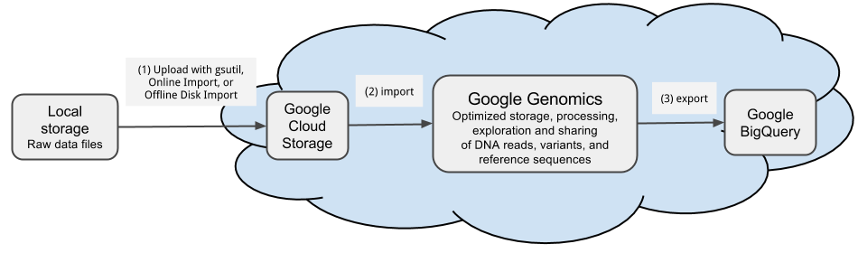

Load Genomic Variants
=====================

.. toctree::
   :maxdepth: 3

.. contents::

Prerequisites
-------------

1. Sign up for Google Genomics by doing all the steps in `Google Genomics: Try it now <https://cloud.google.com/genomics/>`_.
2. Sign up for Google Cloud Storage by doing all the steps in `Google Cloud Storage: Try it now <https://cloud.google.com/storage/docs>`_.

Step 1: Upload variants to Google Cloud Storage
--------------------------------------------------------
For the purposes of this example, let's assume you have a local copy of the `Illumina Platinum Genomes variants <https://cloud.google.com/genomics/data/platinum-genomes>`_ that you would like to load.

**Note** *Google Genomics cannot load compressed VCFs so for now be sure to uncompress them prior to uploading them to cloud storage.  We expect to support compressed VCFs soon.*

Transfer the data.
~~~~~~~~~~~~~~~~~~

To transfer a glob of files::

  gsutil -m -o 'GSUtil:parallel_composite_upload_threshold=150M' cp *.vcf \
  gs://YOUR_BUCKET/platinum-genomes/vcf/

Or to transfer a directory tree of files::

  gsutil -m -o 'GSUtil:parallel_composite_upload_threshold=150M' cp -R YOUR_DIRECTORY_OF_VCFS \
  gs://YOUR_BUCKET/platinum-genomes/

If any failures occur due to temporary network issues, re-run with the no-clobber flag to transmit just the missing files::

  gsutil -m -o 'GSUtil:parallel_composite_upload_threshold=150M' cp -n -R YOUR_DIRECTORY_OF_VCFS \
  gs://YOUR_BUCKET/platinum-genomes/

For more detail, see the `gsutil cp command <https://cloud.google.com/storage/docs/gsutil/commands/cp>`_.

Check the data.
~~~~~~~~~~~~~~~

When you are done, the bucket will have contents similar to this but with your own bucket's name::

  $ gsutil ls gs://genomics-public-data/platinum-genomes/vcf
  gs://genomics-public-data/platinum-genomes/vcf/NA12877_S1.genome.vcf
  gs://genomics-public-data/platinum-genomes/vcf/NA12878_S1.genome.vcf
  gs://genomics-public-data/platinum-genomes/vcf/NA12879_S1.genome.vcf
  gs://genomics-public-data/platinum-genomes/vcf/NA12880_S1.genome.vcf
  gs://genomics-public-data/platinum-genomes/vcf/NA12881_S1.genome.vcf
  gs://genomics-public-data/platinum-genomes/vcf/NA12882_S1.genome.vcf
  gs://genomics-public-data/platinum-genomes/vcf/NA12883_S1.genome.vcf
  gs://genomics-public-data/platinum-genomes/vcf/NA12884_S1.genome.vcf
  gs://genomics-public-data/platinum-genomes/vcf/NA12885_S1.genome.vcf
  gs://genomics-public-data/platinum-genomes/vcf/NA12886_S1.genome.vcf
  gs://genomics-public-data/platinum-genomes/vcf/NA12887_S1.genome.vcf
  gs://genomics-public-data/platinum-genomes/vcf/NA12888_S1.genome.vcf
  gs://genomics-public-data/platinum-genomes/vcf/NA12889_S1.genome.vcf
  gs://genomics-public-data/platinum-genomes/vcf/NA12890_S1.genome.vcf
  gs://genomics-public-data/platinum-genomes/vcf/NA12891_S1.genome.vcf
  gs://genomics-public-data/platinum-genomes/vcf/NA12892_S1.genome.vcf
  gs://genomics-public-data/platinum-genomes/vcf/NA12893_S1.genome.vcf

For more detail, see the `gsutil ls command <https://cloud.google.com/storage/docs/gsutil/commands/ls>`_.

Step 2. Import variants to Google Genomics
--------------------------------------------

Create a Google Genomics dataset to hold your data.
~~~~~~~~~~~~~~~~~~~~~~~~~~~~~~~~~~~~~~~~~~~~~~~~~~~

* YOUR_DATASET_NAME: This can be any name you like such as "My Copy of Platinum Genomes".

* YOUR_GOOGLE_CLOUD_PLATFORM_PROJECT_NUMBER: You can find your Google Cloud Platform project number towards the top of the `Google Developers Console <https://console.developers.google.com/project/>`_ page. ::

   $ java -jar genomics-tools-client-java-v1beta2.jar createdataset --name YOUR_DATASET_NAME \
   --project_number YOUR_GOOGLE_CLOUD_PLATFORM_PROJECT_NUMBER
   {
    "id" : "THE_NEW_DATASET_ID",
    "isPublic" : false,
    "name" : "YOUR_DATASET_NAME",
    "projectNumber" : "YOUR_GOOGLE_CLOUD_PLATFORM_PROJECT_NUMBER"
   }

For more detail, see `managing datasets <https://cloud.google.com/genomics/v1beta2/managing-datasets>`_.

Import your VCFs from Google Cloud Storage to your Google Genomics Dataset.
~~~~~~~~~~~~~~~~~~~~~~~~~~~~~~~~~~~~~~~~~~~~~~~~~~~~~~~~~~~~~~~~~~~~~~~~~~~~
* THE_NEW_DATASET_ID: This was returned in the output of the prior command.

::

  $ java -jar genomics-tools-client-java-v1beta2.jar importvariants \
  --variant_set_id THE_NEW_DATASET_ID \
  --vcf_file gs://YOUR_BUCKET/platinum-genomes/vcf/*.vcf
  Import job: {
    "id" : "THE_NEW_IMPORT_JOB_ID",
    "status" : "pending"
  }

For more detail, see `managing variants <https://cloud.google.com/genomics/v1beta2/managing-variants>`_.

Check the import job for completion.
~~~~~~~~~~~~~~~~~~~~~~~~~~~~~~~~~~~~

* THE_NEW_IMPORT_JOB_ID: This was returned in the output of the prior command.

::

  $ java -jar genomics-tools-client-java-v1beta2.jar getjob --poll --job_id THE_NEW_IMPORT_JOB_ID
  Waiting for job: job_id
  ...
  {
    "status" : "success",
    "importedIds" : ["call_set_id", "call_set_id"],
    "warnings" : []
  }

Step 3. Export variants to Google BigQuery
------------------------------------------

Create a BigQuery dataset in the web UI to hold the data.
~~~~~~~~~~~~~~~~~~~~~~~~~~~~~~~~~~~~~~~~~~~~~~~~~~~~~~~~~

#. Open the `BigQuery web UI <https://bigquery.cloud.google.com/>`_.

#. Click the down arrow icon |down-arrow| next to your project name in the navigation, then click **Create new dataset**.

#. Input a dataset ID.

.. |down-arrow| image:: https://cloud.google.com/bigquery/images/icon-down-arrow.png

Export variants to BigQuery.
~~~~~~~~~~~~~~~~~~~~~~~~~~~~

* THE_NEW_DATASET_ID: This was returned in the output of the createdataset command.

* YOUR_BIGQUERY_DATASET: This is the dataset ID you created in the prior step.

* YOUR_BIGQUERY_TABLE: This can be any ID you like such as "platinum_genomes_variants".

::

  $ java -jar genomics-tools-client-java-v1beta2.jar exportvariants \
  --project_id YOUR_GOOGLE_CLOUD_PLATFORM_PROJECT_NUMBER \
  --variant_set_id THE_NEW_DATASET_ID \
  --bigquery_dataset YOUR_BIGQUERY_DATASET \
  --bigquery_table YOUR_BIGQUERY_TABLE
  Export job: {
    "id" : "THE_NEW_EXPORT_JOB_ID",
    "status" : "pending"
  }

For more detail, see `variant exports <https://cloud.google.com/genomics/v1beta2/managing-variants#exports>`_

Check the import job for completion.
~~~~~~~~~~~~~~~~~~~~~~~~~~~~~~~~~~~~
* THE_NEW_EXPORT_JOB_ID: This was returned in the output of the prior command.

::

  $ java -jar genomics-tools-client-java-v1beta2.jar getjob --poll --job_id THE_NEW_EXPORT_JOB_ID
  Waiting for job: job_id
  ...
  {
    "status" : "success",
    "importedIds" : ["call_set_id", "call_set_id"],
    "warnings" : []
  }

Now you are ready to start `querying your variants <https://github.com/googlegenomics/getting-started-bigquery>`_!

.. include:: ../../includes/footer.rst

